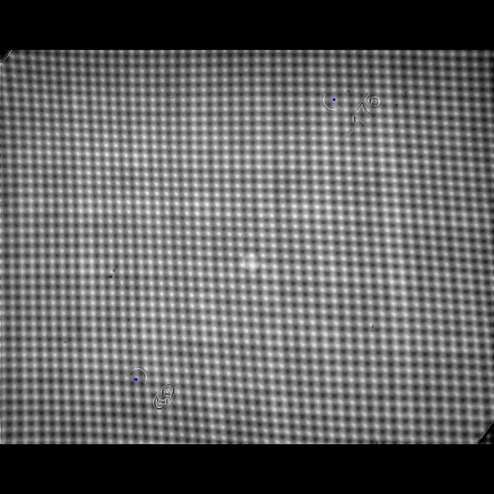

<!-- @import "[TOC]" {cmd="toc" depthFrom=1 depthTo=6 orderedList=false} -->

<!-- code_chunk_output -->

- [PRODUCTION](#production)
  - [1. 使用](#1-使用)
    - [1.1 下载](#11-下载)
    - [1.2 指令](#12-指令)
    - [1.3 结果](#13-结果)
- [2. 相关资源](#2-相关资源)
  - [2.1 训练库](#21-训练库)
  - [2.2 推理库](#22-推理库)

<!-- /code_chunk_output -->

# PRODUCTION
## 1. 使用
### 1.1 下载
```
链接：https://pan.quark.cn/s/74663448c75f
```
### 1.2 指令
```
.\Production.exe .\text_det.onnx .\text_direction_cla.onnx .\text_rec.onnx .\charset.txt '.\2022-12-08 14-54-28_000149.bmp' res.txt vis.jpg
```
### 1.3 结果
```
Point1 691.914,206.116
Point2 282.269,786.145
Distance 710.1
Angle 54.7684
IsRight 1
```


# 2. 相关资源

## 2.1 训练库
* [有向/通用目标检测训练库: PrecisionAngleDetection](https://github.com/johnson-magic/PrecisionAngleDetection)
* [通用分类训练库: SimpleClassifier](https://github.com/johnson-magic/SimpleClassifier)
* [通用sequence2sequence训练库: SimpleSequence](https://github.com/johnson-magic/SimpleSequence)

## 2.2 推理库
* [有向/通用目标检测推理库: PrecisionAngleDetectionInference](https://github.com/johnson-magic/PrecisionAngleDetectionInference)
* [通用分类推理库: ClassifierInference](https://github.com/johnson-magic/ClassifierInference)
* [通用sequence2sequence推理库: SequenceInference](https://github.com/johnson-magic/SequenceInference)